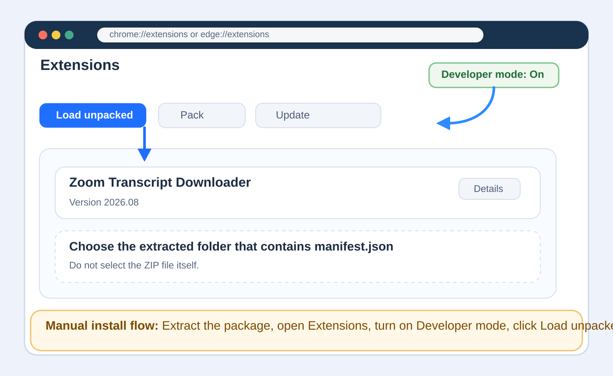
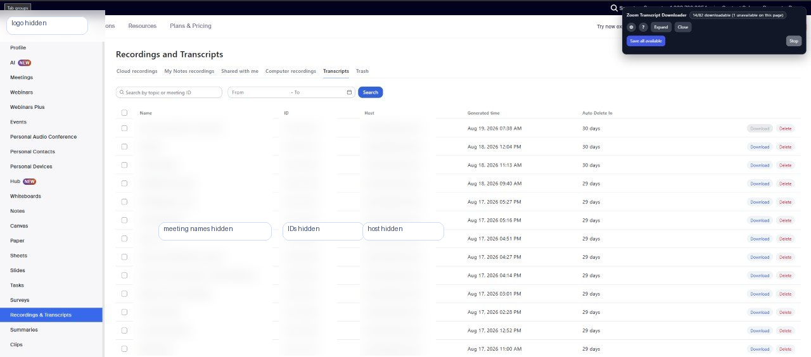
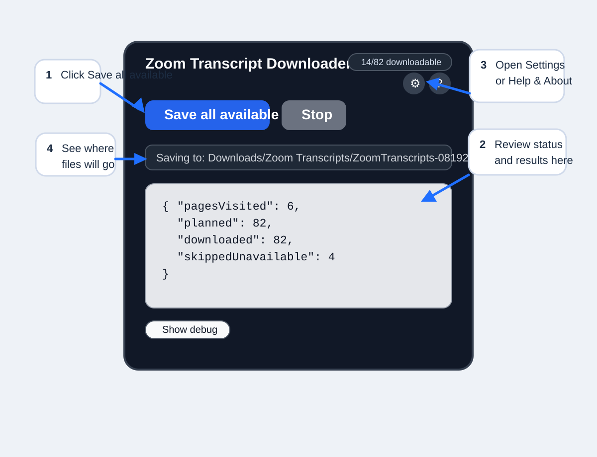
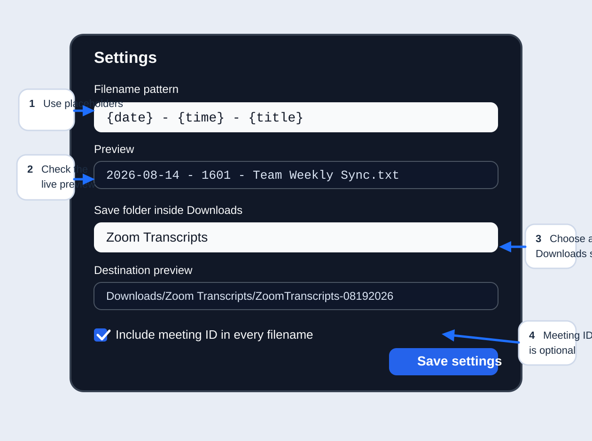

# Zoom Transcript Downloader User Guide

Version: 2026.09

## What Zoom Transcript Downloader Does

Zoom Transcript Downloader helps you save the transcript text files that Zoom makes available on its web-based **Transcripts** page.

Its main workflow is intentionally simple:

1. Open the Zoom **Transcripts** page.
2. Confirm the Zoom Transcript Downloader panel appears.
3. Click **Save all**.
4. Keep the Zoom tab open until the run finishes.

The extension then works through the available transcript pages, downloads the transcript text that Zoom allows, and saves the files with organized filenames.

## Install The Extension

### Recommended: Chrome Web Store

The easiest installation method is the direct Chrome Web Store listing:

<https://chrome.google.com/webstore/detail/lbmejjnmnbjnoahehjfmhaiheopkgcdg>

Because this listing is private or unlisted, you will usually open it from the direct link instead of searching the Chrome Web Store.

To install in Chrome:

1. Open the Chrome Web Store link.
2. Select **Add to Chrome**.
3. Review the prompt and approve the installation.
4. Open the browser **Extensions** menu and confirm **Zoom Transcript Downloader** appears there.
5. If you want easier access, pin the extension from the Extensions menu.

### Microsoft Edge

Microsoft Edge can install many Chrome Web Store extensions. If Edge shows a banner asking whether to allow extensions from other stores:

1. Open the same Chrome Web Store link in Edge.
2. Select **Allow extensions from other stores** if prompted.
3. Select the extension's install button.
4. Review the permissions prompt and finish the installation.

After installation, confirm **Zoom Transcript Downloader** appears in Edge's **Extensions** menu. Pin it if you want quick access.

### Alternative: Manual Installation

Use manual installation if:

- you were given the source package directly
- Chrome Web Store installation is unavailable
- you are testing or developing locally

1. Obtain the extension package or source folder.
2. If it arrives as a ZIP file, extract it first.
3. Do not try to load the ZIP file directly.
4. Keep the extracted folder somewhere it will not be accidentally deleted or moved.
5. Open the browser Extensions page:
   - Chrome: `chrome://extensions`
   - Edge: `edge://extensions`
6. Turn on **Developer mode**.
7. Select **Load unpacked**.
8. Choose the extracted folder that contains `manifest.json`.
9. Confirm **Zoom Transcript Downloader** appears in the browser.
10. Optionally pin it from the browser's Extensions menu.

## Open Your Zoom Transcripts

Before using the extension, open the Zoom web page that lists transcript entries.

1. Sign in to your organization's Zoom web portal.
2. Go to the area that contains cloud recordings or transcripts.
3. Open the **Transcripts** tab or view.
4. Confirm that transcript rows are visible on the page.

Example URL format:

`https://your-company.zoom.us/recording/meeting/transcript`

That is only an example. Your Zoom hostname or navigation path may look different.

When you open a supported Zoom **Transcripts** page, the Zoom Transcript Downloader panel should appear automatically on the page.

If you closed the panel earlier, use the browser extension icon from the **Extensions** menu to open it again.

## Download All Available Transcripts

1. Open the Zoom **Transcripts** page.
2. Confirm the Zoom Transcript Downloader panel is visible.
3. Review the status count if you want.
4. Click **Save all**.
5. Keep that Zoom tab open while the run is in progress.
6. Wait for the completion message.

If you only want the transcripts that are currently visible on the page, click **Save page** instead.

## What Happens During A Download

While the extension is running, it:

1. returns to page 1 before starting
2. reviews the transcript pages so it can plan the final filenames
3. works through the available transcript rows
4. saves the available transcript files
5. skips rows that Zoom marks as unavailable
6. shows the final result when the run finishes

You do not need to manage the page changes yourself.

## Where Your Files Are Saved

Zoom Transcript Downloader saves files inside your browser's normal **Downloads** location.

You can set a folder underneath Downloads, such as:

- `Zoom Transcripts`
- `Work/Zoom Transcripts`

The final save path will look like:

- `Downloads/Zoom Transcripts/ZoomTranscripts-08192026`
- `Downloads/Work/Zoom Transcripts/ZoomTranscripts-08192026`

For security reasons, browser extensions normally write inside the browser's Downloads location instead of saving directly anywhere on your computer.

### Recommended: Use A Dedicated Transcript Folder

For easier organization, we recommend using a dedicated folder for Zoom transcripts instead of mixing them with unrelated downloads.

Example:

`Downloads/Zoom Transcripts`

This is optional. A dedicated transcript folder is recommended for organization, not required for the extension to work.

## Customize File Names And Download Location

Open **Settings** from the panel if you want to change how files are named or where they are organized under **Downloads**.

### Filename Format

Default filename format:

`{date} - {time} - {title}`

Example result:

`2026-08-14 - 1601 - Team Weekly Sync.txt`

### Available Placeholders

You can customize filenames with placeholders.

| Placeholder | Meaning | Example |
| --- | --- | --- |
| `{date}` | Meeting date in `YYYY-MM-DD` format | `2026-08-14` |
| `{time}` | Meeting time in `HHMM` format | `1601` |
| `{title}` | Zoom meeting title | `Team Weekly Sync` |
| `{meetingId}` | Zoom meeting ID | `12345678901` |

Example patterns:

- `{date} - {time} - {title}`
- `{date} - {title}`
- `{date} - {time} - {title} - {meetingId}`

### Meeting ID

Meeting ID is not included in every filename by default, which keeps filenames cleaner.

If two transcripts would otherwise receive the same filename, Zoom Transcript Downloader automatically adds the Meeting ID to keep those files unique.

Turn on **Include meeting ID in every filename** if you want the Meeting ID to appear every time.

### Download Folder

Use **Save folder inside Downloads** to place transcripts in a subfolder beneath your browser's normal Downloads location.

Examples:

- `Zoom Transcripts`
- `Work/Zoom`

### Preview Your Settings

The Settings dialog shows:

- a filename preview
- a destination preview

Use those previews to confirm your settings before you save them.

## Stop A Download

If you need to interrupt a batch:

1. Click **Stop**.
2. The extension will finish the transcript it is currently saving.
3. The run will then stop.

Stop does not instantly cancel a transcript that is already being processed.

## Unavailable Or Skipped Transcripts

Some transcript rows shown by Zoom may not currently offer a working download action.

When that happens, the extension skips those rows and continues with the available ones.

Skipped transcripts do not automatically mean the extension failed.

## Troubleshooting

### The Extension Panel Does Not Appear

Try these steps:

1. Confirm you are on a supported Zoom **Transcripts** page.
2. Wait a moment for the Zoom page to finish rendering after navigation.
3. Confirm the extension is installed and enabled.
4. Open the browser **Extensions** menu and select the extension icon to reopen the panel if you closed it.
5. If you manually installed or updated the extension, open the browser Extensions page and select **Reload**, then refresh the Zoom tab.

### No Transcripts Are Found

1. Confirm Zoom is showing transcript rows on the page.
2. Confirm you are on **Transcripts**, not a different recordings view.
3. Refresh the Zoom page and wait for the list to finish loading.
4. Confirm Zoom itself is offering transcript downloads for those entries.

### Some Transcripts Were Skipped

This usually means Zoom displayed transcript entries whose download action was unavailable.

The extension intentionally skips unavailable rows so it can continue with the transcripts Zoom currently allows.

### The Download Stopped Because The Page Changed

This means the Zoom transcript list changed while the extension was processing it.

Recommended recovery:

1. Refresh the Zoom page.
2. Wait for the transcript list to finish loading.
3. Start **Save all** again.

### Files Are Not Where Expected

Check these places:

1. Your browser's normal **Downloads** location.
2. The Downloads subfolder shown in **Settings**.
3. The destination preview in **Settings**.
4. The browser's downloads history page if needed.

### Browser Prompts For Every File

Batch downloading works best when the browser does not ask where to save every file.

If you are prompted for each transcript:

1. Open your browser download settings.
2. Turn off **Ask where to save each file before downloading** in Chrome, or the equivalent per-download prompt in Edge.
3. Try the batch again.

### The Extension Stopped Working After A Zoom Update

Zoom Transcript Downloader depends on Zoom's current website behavior, so Zoom page changes can occasionally break part of the workflow.

If that happens:

1. Check whether a newer extension build is available.
2. If you installed manually, reload the extension from the browser Extensions page.
3. Refresh the Zoom page and try again.
4. Report the problem if it continues.

## Advanced Troubleshooting And Debug Information

Use **Show debug** only when you are diagnosing a problem or preparing a support report.

Suggested workflow:

1. Turn on **Show debug**.
2. Reproduce the problem.
3. Copy the relevant debug details or take a screenshot.
4. Include that information when reporting the issue.

The debug view may include meeting titles, meeting IDs, page information, and Zoom page URLs, so review it before sharing it outside your organization.

## Updating The Extension

### Chrome Web Store Version

Browser-installed extensions normally update automatically through Chrome or Edge.

If you believe you are still on an older version, close and reopen the browser, then check the extension again.

### Manually Installed Version

If you use **Load unpacked**:

1. Replace or update the local extension files.
2. Open `chrome://extensions` or `edge://extensions`.
3. Select **Reload** for Zoom Transcript Downloader.
4. Refresh the Zoom page.

## Getting Help / Reporting A Problem

Use **Help & About** from the `?` button in the panel footer for project information and the GitHub repository link.

When reporting a problem, include:

- which browser you used
- whether you installed from the Chrome Web Store or manually
- what you expected to happen
- what actually happened
- any relevant debug details or screenshots

## Version / Compatibility Information

This guide matches:

- **Zoom Transcript Downloader** version `2026.09`
- Supported browsers: **Google Chrome** and **Microsoft Edge**
